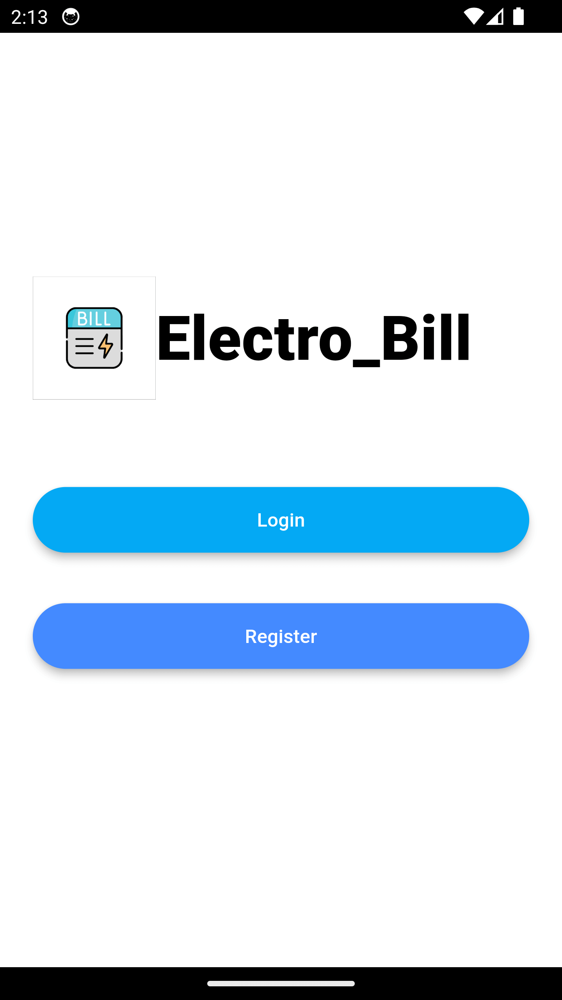
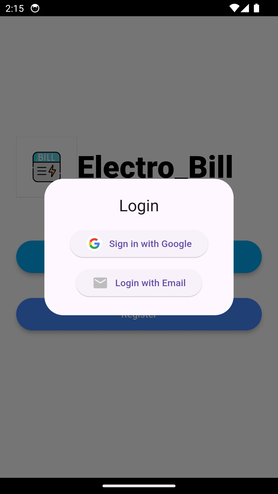
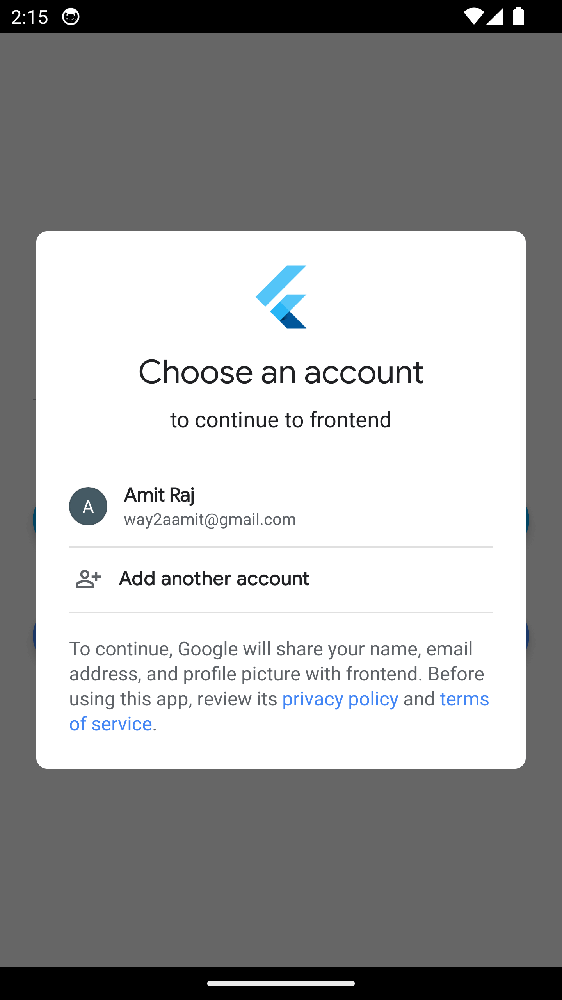
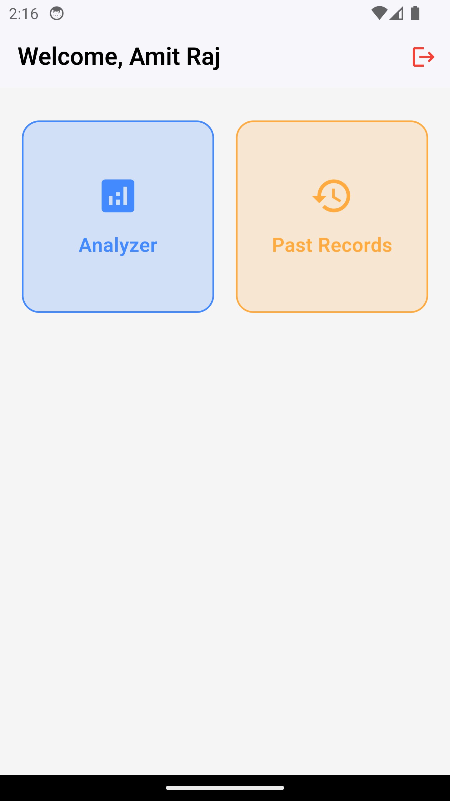
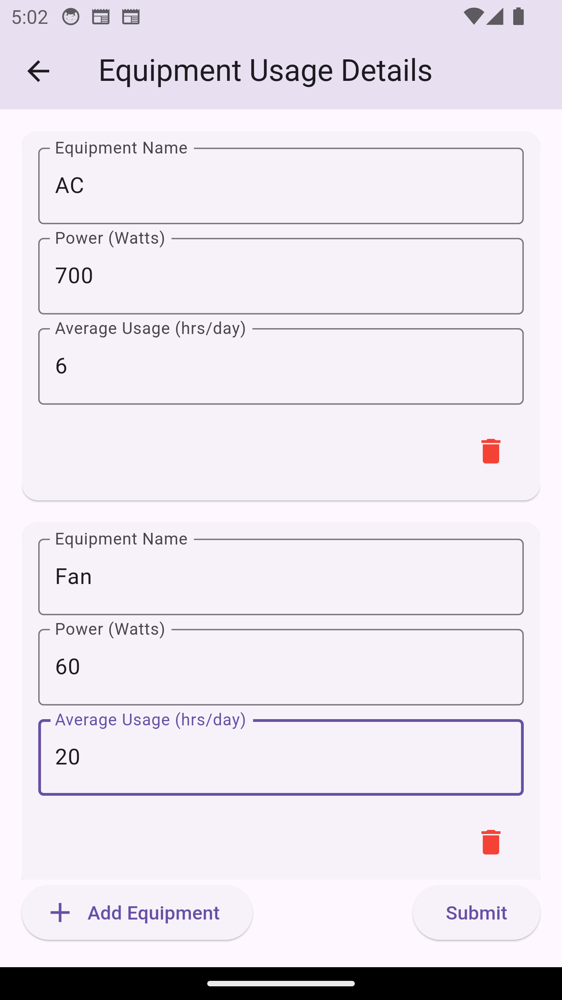

# Electro_Bill

**Your monthly Electricity Bill Calculator App**.

Just input your this month electricity bill data and fill all the details in the Equipment entry screen(refer below) and finally submit it.Let the Genetic Algorithm do the work in the background and give you the results in few seconds.

### 🔸 Home Screen

  

### 🔸 Login Screen

  

### 🔸 Login Screen 2

  

### 🔸 Home Screen

  

### 🔸 Equipment Entry Screen

  

